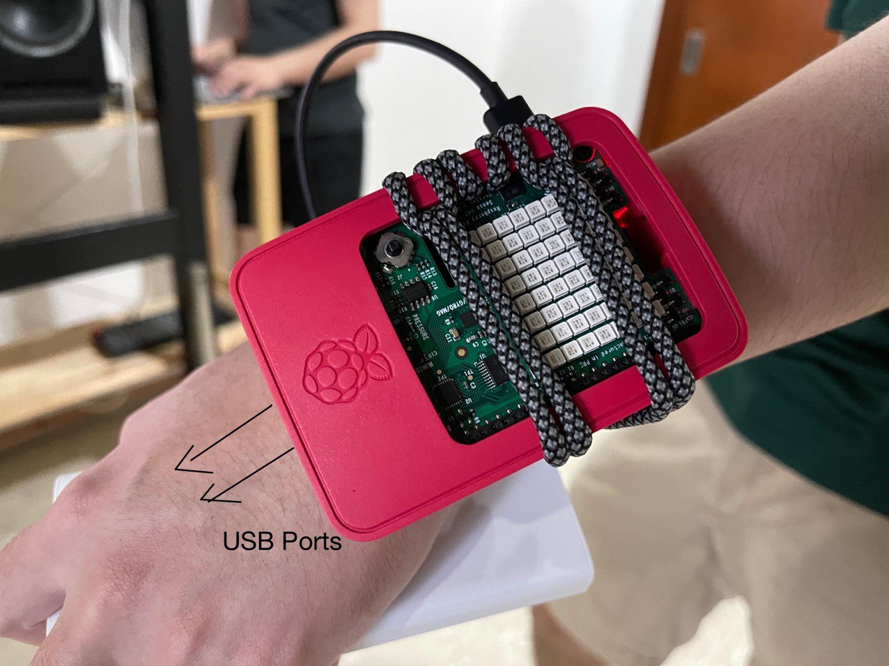

# LabProj-G18 - Team Whole Garden
## FallSafe

| Team Members        | ID        | GitHub Name     |
|---------------------|-----------|-----------------|
| Chen Yu             | 1901843   | Cerlancism      |
| Ng Cheuk Fung       | 16ADG049Y | chalkfung       |
| Edwin Tang Qin Kang | 1901858   | TanglingTreats  |
| Tan Peikai          | 1901853   | catkane-doodles |
| Tan Qi Guang        | 1901844   | qg25            |


### Abstract
The elderly are prone to having poor balance, muscle weaknesses, slow reaction time and  joint problems due to old age. Additionally, medication for age-related illnesses may cause deterioration in cognitive and motor skills. This puts them at a high risk of incurring serious injuries or a loss of life by a fall.
This project explores the possibility of lowering the chances of serious injuries and or a loss of life by detecting falls through a wearable.

### Product Overview
FallSafe is an embedded device designed to be worn on the left wrist by a user who has a high risk of falling. This device predicts the current physical activity based on a preloaded machine learning model trained on average user behaviours. 

If a fall is detected, the letter “F” will be drawn on the SenseHat LED Matrix and a fall alert email is sent to the desired recipient. If the detected fall is a false positive, the model can learn through reinforcement learning using the user’s input. 

### Equipment and Reasoning:
#### Controller:
- 1x Raspberry Pi 3 Model B+  
This is required by the project. Ideally, we would be using a Raspberry Pi Zero instead, as it is much smaller, and easier to convert into a wearable. 

#### Output:
- 1x SenseHat (LED)
This provides visual feedback of the current state of the user (F - Falling, W - Walking, R - Running, S - Stationary)

#### Input(s):
- 1x SenseHat (Comes with Gyroscope, Accelerometer and Joystick)  


This is what we currently possess, and suits our needs. However, standalone accelerometer and button would make the entire package smaller, and use less power, which would be better suited for an actual product.  

We will be using accelerometer data to detect if a fall has occurred through a neural network and defined thresholds that will be calculated using algorithms. The SenseHat module will be used to display the current status of the wearer.  

If a false positive occurs, the user can choose the appropriate option which best represents the action that the user was doing at the moment of the false positive.
This can be done by using the joystick to navigate left or right and pressing to enter option.The last collected sensor data will then be used to reinforce the learning for the respective categories.


### Installation Guide:
#### System Dependencies:
Raspberry PI OS Debian Buster

`cat /etc/os-release`

Expected output
 
`PRETTY_NAME="Raspbian GNU/Linux 10 (buster)"
NAME="Raspbian GNU/Linux" 
VERSION_ID="10"
VERSION="10 (buster)"
VERSION_CODENAME=buster
ID=raspbian
ID_LIKE=debian
HOME_URL="http://www.raspbian.org/"
SUPPORT_URL=http://www.raspbian.org/RaspbianForums
BUG_REPORT_URL="http://www.raspbian.org/RaspbianBugs"
`

More information available at: https://www.raspberrypi.org/blog/buster-the-new-version-of-raspbian/

#### Enable I2C:
`sudo raspi-config`

Interface Option → Enable I2C → Yes

`sudo reboot`

#### Install i2c tools, dev library and smbus library:

`sudo apt-get install -y python-smbus i2c-tools libi2c-dev wiringpi`

To Verify: `ls /usr/include/i2c/`

Expected output: `smbus.h`

#### Building the Binary:

Our project can be simply built using the makefile included if the system dependencies are satisfied.

In our project directory:

`make`

The binary will be output at our project directory

`./bin/fallsafe`

### Usage Guide:
#### Hardware Setup:

It's recommended to Calibrate the sensors at: https://www.raspberrypi.org/documentation/hardware/sense-hat/

With a portable USB Power supply, strap the Raspberry to the left wrist as follows:


#### Software Setup:
Internet connection required is for Thingsboard and Email sending, but they can be disabled.

Personal HotSpot from a mobile phone is recommended since this is a portable device.

SSH is recommended to access and start the program.

The full build binary of the program is found in ./bin/fallsafe from our project directory. Refer to the compilation section above on how to rebuild the binary.

Our program has various command line argument options to configure how the program is to be run.

For help: `./bin/fallsafe -h`


```
-e Email recipient for the fall alert, no email sending if not supplied

-a MQTT Thingsboard access token, default to our team's Thingsboard if not supplied

-n Disables MQTT Thingsboard

-t Data processing interval in milliseconds, defaults to 1000

-l 0 to disable LED to save power, defaults to 1

-h Prints this help message
```
#### Examples to Start the Program:
The program should be run with sudo permissions for open().

##### Using our Team's default Thingsboard access token and a fall alert email receiver:

`sudo ./bin/fallsafe -e test@example.com`

##### Using non-default Thingsboard access token and email:

`sudo ./bin/fallsafe -e test@example.com -a @cc3$$t0k3n`

⚠ Warning: Invalid access token will cause the program to exit with MQTT_ERROR_CONNECTION_REFUSED error.

#### Run without MQTT, Email and LED:

`sudo ./bin/fallsafe -n -l 0`

